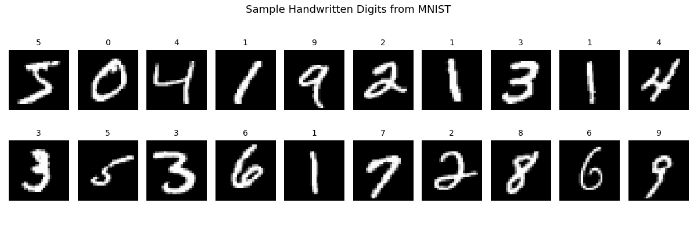
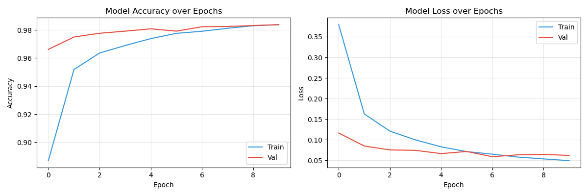
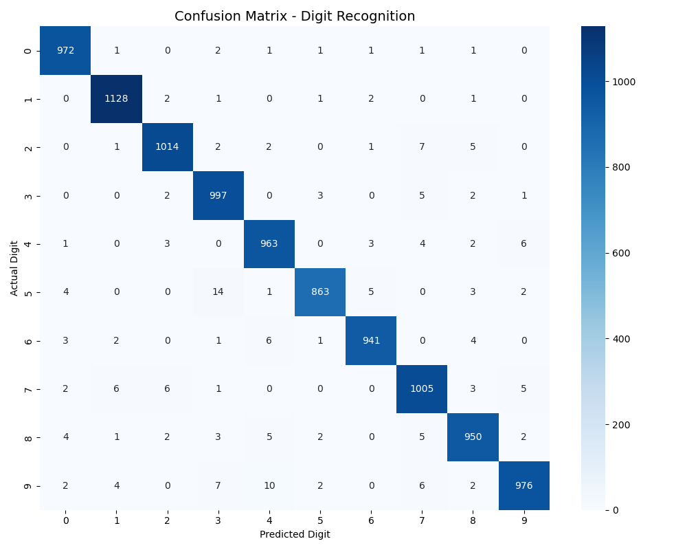
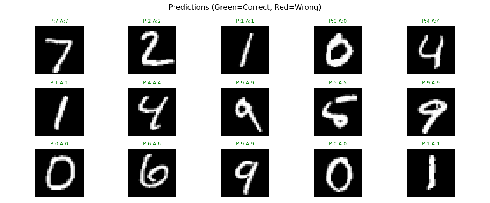

# Handwritten Digit Recognizer 🧠

Neural network that reads handwritten digits with ~98% accuracy,
trained on the MNIST dataset of 70,000 images.

## Tools Used
- Python, TensorFlow, Keras, NumPy, Matplotlib, Seaborn

## Model Architecture
- Input Layer: 784 neurons (28x28 pixels flattened)
- Hidden Layer 1: 256 neurons (ReLU) + Dropout
- Hidden Layer 2: 128 neurons (ReLU) + Dropout
- Output Layer: 10 neurons (Softmax) — one per digit

## Results
- Test Accuracy: ~98.5%
- Trained on 60,000 images, tested on 10,000 images

## Charts

